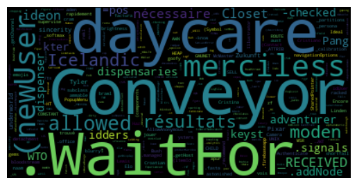
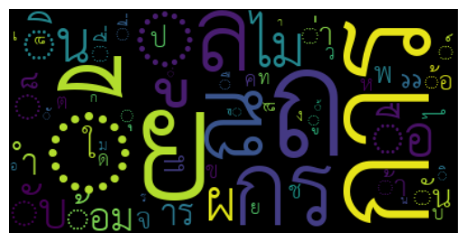

# Project Overview: GPT Tokenizer Analysis
## Objective: 
To quantify the language bias within the GPT tokenizer, particularly focusing on its distribution of tokens across different languages.

## Background: 
The GPT tokenizer is known for its inclination towards English text due to the vast amount of English document during training Byte Pair Encoding (BPE) tokenizer. This project aims to analyze and present concrete data on the extent of this skew.

## Methodology: 
Using the tiktoken analyzer, we dissect the GPT tokenizer’s language distribution.

## Findings:

| language | size | sampling | percent_ratio |
| :--: | :--: | :--: | :--: |
| en |	88191 |	 meal   pcb   proficient   Wohn   syn  zo   Madame  _metadata   ordained  _push | 98.8323
| th |	57 | 	ั ร ไม ต ้ ง ื่ ท ื ล	| 0.0639
| jp |	985 |	描述 県 キ 藏 最 后 作 第 设置 结	| 1.1039

From summary table:
* English Text Tokens: A staggering 98.8% of tokens are dedicated to English text! highlighting a significant bias towards the English language.
* Thai Text Tokens: In contrast, a mere 0.06% of tokens represent Thai text, indicating a substantial underrepresentation.
* Japanese Text Tokens: Japanese text fares slightly better, with 1.1% of tokens, but still showcases a notable disparity.

## Conclusion: 
The analysis confirms a heavy bias in the GPT tokenizer towards English, with other languages like Thai and Japanese being significantly underrepresented. This insight could be pivotal for future developments in tokenizer technology to create a more balanced linguistic representation.

# Visualization
The rank of a token is determined during the BPE (Byte Pair Encoding) merge phase, where the most common pairs of tokens are merged, incrementally generating a new rank. This means that tokens with a higher rank always have a longer text length, and thus, typically form more meaningful words.

By generating a word cloud sorted by rank and grouped by language, we can observe the themes of the longest possible texts in various languages.

From the word cloud below, it is clear that the longest text in the Thai token is `การ`, which is not a meaningful word at all 😂. This results in GPT needing to compose multiple tokens to form a single word, and many more tokens to form a paragraph! In contrast, with English tokens, a single token often represents a meaningful word, such as `conveyor`, `daycare`, or `merciless`.

## English


## Thai


## Japanese


# Set up

To reproduce this project on your local machine, I recommend to use [rye](https://rye-up.com/) as a package manager and also a python version management. Personally recommended to use `uv` as package installer for blazingly fast package resolving & installing using Rust!

After you have `rye` installed:

1. Run `rye sync --no-lock` to generate `.venv` in your directory. And if you didn't already have `python 3.12`, rye will also set that up for you.
2. Run `rye run analyze-gpt-tokenizer` to generate `summary.csv` and `token_text.csv` for further analysis!
3. You can also check additional params by running `rye run analyze-gpt-tokenizer --help`

# Project structure

```tree
├── README.md
├── notebooks  # For interative analysis
│   ├── analyze.ipynb
│   ├── data
│   │   └── cl100k_base.tiktoken
│   ├── fonts
│   │   ├── *.ttf
│   └── output
│       ├── cl100k_base.text.csv
│       └── cl100k_base.token_summary.csv
├── pyproject.toml
├── requirements-dev.lock
├── requirements.lock
└── src  # Command line source code
    └── analyze_gpt_tokenizer
        ├── __init__.py
        ├── __main__.py
        ├── _types.py
        ├── config.py
        └── utils.py
```